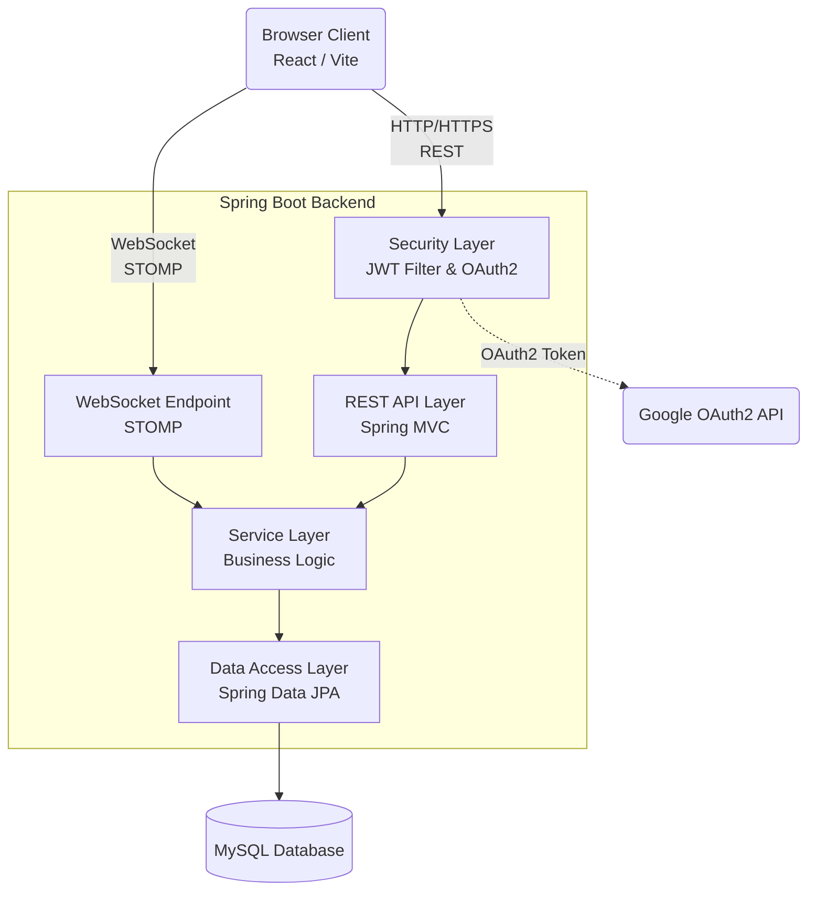
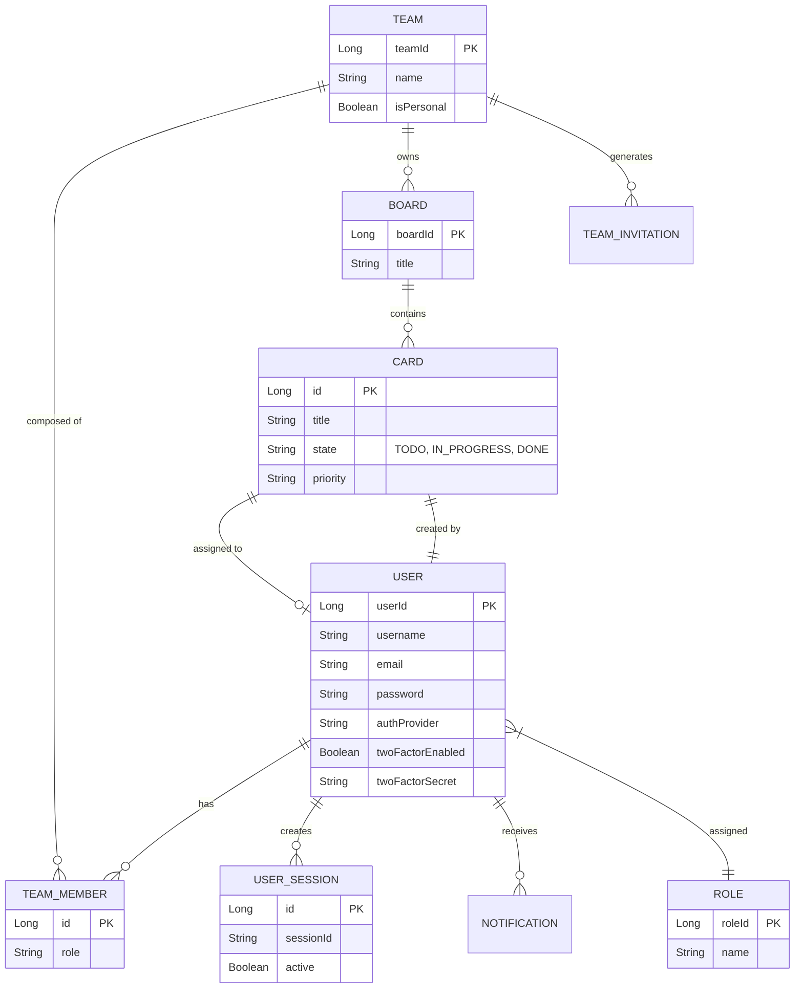
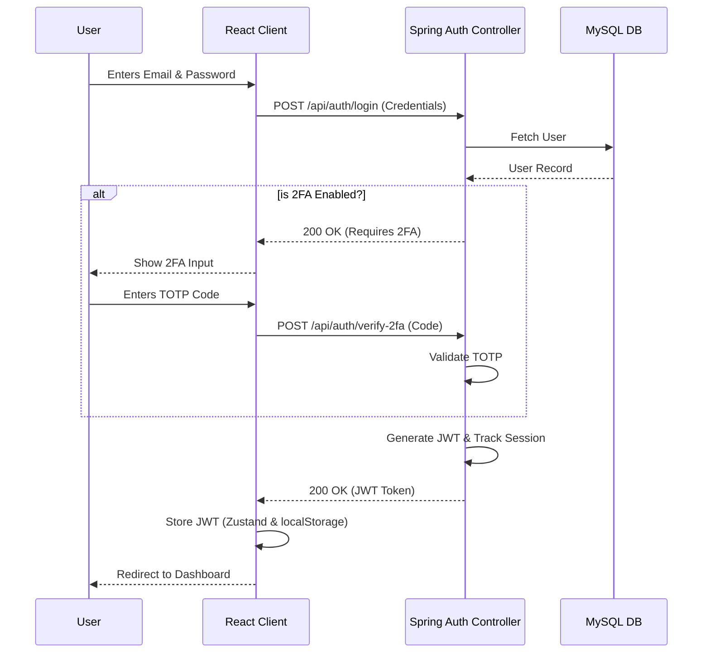
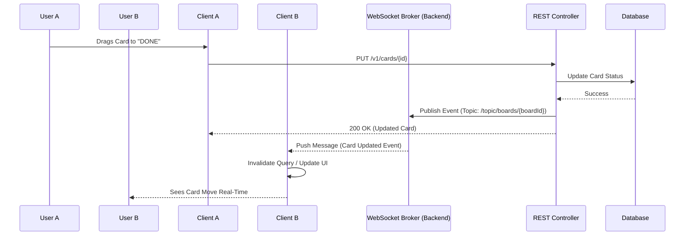

# TaskFlow (Task Management System)

TaskFlow is a robust, full-stack, real-time task and project management system designed to help teams organize their work effortlessly. Built with a responsive React frontend and a scalable Spring Boot backend, it supports real-time collaboration via WebSockets, multi-team workspaces, robust role-based access control, and 2FA authentication.

---

## 🛠️ Technology Stack

### Frontend
- **Framework**: React 19 (Vite)
- **Styling**: Tailwind CSS, Framer Motion
- **State Management**: Zustand (Auth, Teams, UI), TanStack Query (Server State)
- **Real-Time**: STOMP over SockJS
- **Drag & Drop**: @dnd-kit/core

### Backend
- **Framework**: Java 17, Spring Boot 3
- **Security**: Spring Security, JWT Auth, Google OAuth2, 2FA (TOTP)
- **Real-Time**: Spring WebSocket (STOMP)
- **Database**: MySQL, Spring Data JPA, Hibernate

---

## 📐 System Architecture

The following diagram illustrates the high-level architecture of TaskFlow, showing the interaction between the client, backend services, and the database.



---

## 🗃️ Entity-Relationship Diagram (ERD)

This diagram describes the database schema, including Users, Workspaces (Teams), Boards, Cards, and their relationships.



---

## 🔒 Authentication Flow

TaskFlow supports standard JWT-based Authentication, Time-based One-Time Password (TOTP) 2FA, and Google OAuth2 login.



---

## ⚡ WebSocket Real-Time Sync Flow

When a user modifies a board (e.g., drags a card from "TODO" to "DONE"), the change is pushed to all other clients connected to the same workspace/board.



---

## ✨ Features

- **Personal & Team Workspaces**: Create isolated workspaces for personal tasks or invite members for collaborative team projects.
- **Kanban Boards**: Drag-and-drop task management. Cards can have assignees, priorities, and due dates.
- **Real-Time Collaboration**: STOMP over WebSockets ensures that board updates happen in real-time across all connected clients.
- **Robust Authentication**: Supports Standard registration, Google OAuth, and optional 2FA (Authenticator App).
- **Session Management**: View active sessions (IP, Browser, OS) and remotely revoke other sessions for security.
- **Responsive Design**: Polished, dark-themed UI that works flawlessly on desktop and mobile. 
- **Virtualised Rendering**: Ensures ultra-fast rendering for columns containing hundreds of tasks.

---

## 🚀 Setup & Installation

### Prerequisites
- Node.js (v20+)
- Java JDK 17
- MySQL (v8.0+)
- Maven

### 1. Database Setup
Create a MySQL database:
```sql
CREATE DATABASE task_management_system;
```
Configure your credentials in `task-management-system/src/main/resources/application-local.properties`:
```properties
spring.datasource.url=jdbc:mysql://localhost:3306/task_management_system?useSSL=false&serverTimezone=UTC
spring.datasource.username=root
spring.datasource.password=your_password
```

### 2. Backend Setup
```bash
cd task-management-system
mvn clean install
mvn spring-boot:run
```
The API will run on `http://localhost:8080`.

### 3. Frontend Setup
```bash
cd task-management-systemf
npm install
npm run dev
```
The React client will run on `http://localhost:5173`.

---

## 📡 Core API Endpoints

- **Auth**: `POST /api/auth/login`, `POST /api/auth/register`, `POST /api/auth/google`
- **Sessions**: `GET /v1/sessions`, `DELETE /v1/sessions/other`, `DELETE /v1/sessions/{id}`
- **Teams**: `GET /v1/teams`, `POST /v1/teams`, `GET /v1/teams/{teamId}/members`
- **Boards**: `GET /v1/boards`, `POST /v1/boards`
- **Cards**: `GET /v1/boards/{boardId}/cards`, `POST /v1/cards`, `PUT /v1/cards/{id}`, `DELETE /v1/cards/{id}`

*Note: Most endpoints fall under the `/v1/` prefix and require a valid Bearer JWT token.*
